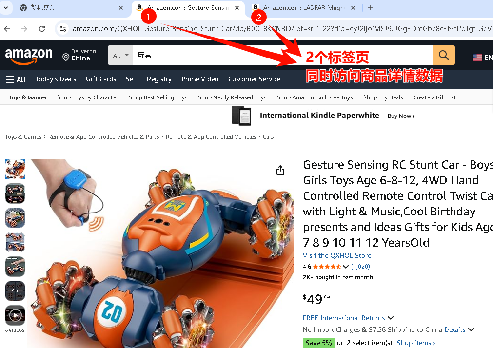
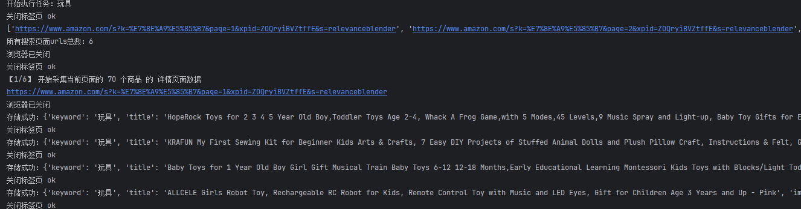
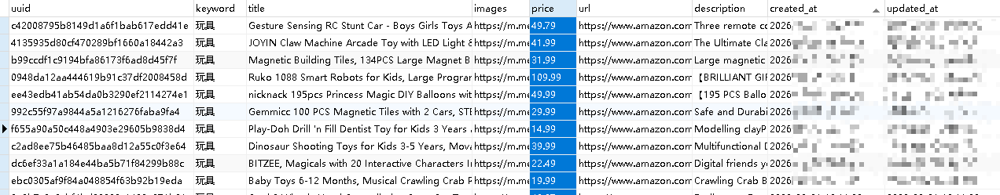

# 部署文档

# 一、python运行环境

## 1、安装python3.9

省略


## 2、安装pip依赖

```bash
mkvirtualenv -p python39 py39_ECommerceSpider

pip install -r requirements.txt
```

# 二、初始化数据库

在mysql中创建库和表：

执行db.sql

# 三、安装谷歌浏览器

由于DrissionPage是驱动谷歌浏览器Chrome进行操作的，所以需要安装谷歌浏览器。

# 四、修改配置文件

## 1、创建配置.env

复制 .env_template 文件，新命名为 .env


## 2、打开 .env 修改配置

### （1）配置mysql连接参数（必须）

修改成你的mysql连接参数

```bash
# MySQL 连接参数
MYSQL_HOST="127.0.0.1"
MYSQL_PORT=3306
MYSQL_USER="root"
MYSQL_PASSWORD="your password"
MYSQL_DATABASE="e_commerce_spider"
```


### （2）修改亚马逊商品类别（必须）

```bash
# 亚马逊配置
TYPE_WORDS_STR="玩具,手机"
# 单个品类格式：TYPE_WORDS_STR="玩具"
# 多个品类格式：TYPE_WORDS_STR="玩具,手机"  【注意】使用英文状态下的逗号。
```


### （3）修改协程访问的并发数（可选）

```bash
# 并发数控制
MAX_CONCURRENT_DETAIL=2  # 采集详情页面时，同时打开的标签页面数。
```




### （4）修改浏览器配置（可选）

```bash
# 浏览器参数
HEADLESS=False # 修改True，不展示浏览器，可提高运行效率。适合正式采集时使用True。查看效果建议使用默认值False。
NO_IMGS=False  # 修改True，不加载图片，可提高采集效率。适合正式采集时使用True。查看效果建议使用默认值False。
```


### （5）设置代理IP（可选）

```bash
# 设置代理IP
PROXY=""
# 默认无代理ip格式：PROXY=""
# 代理ip格式：PROXY="http://127.0.0.1:7890"
```

# 五、启动

## 1、启动命令

```bash
# 启动亚马逊爬虫
python start_amazon_spider.py
```


## 2、运行记录




## 3、查看数据库

